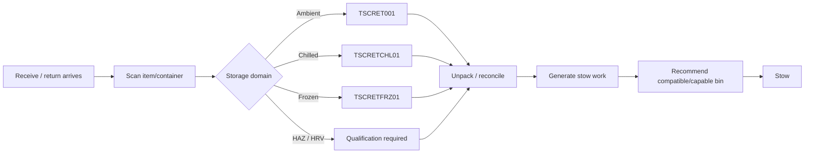
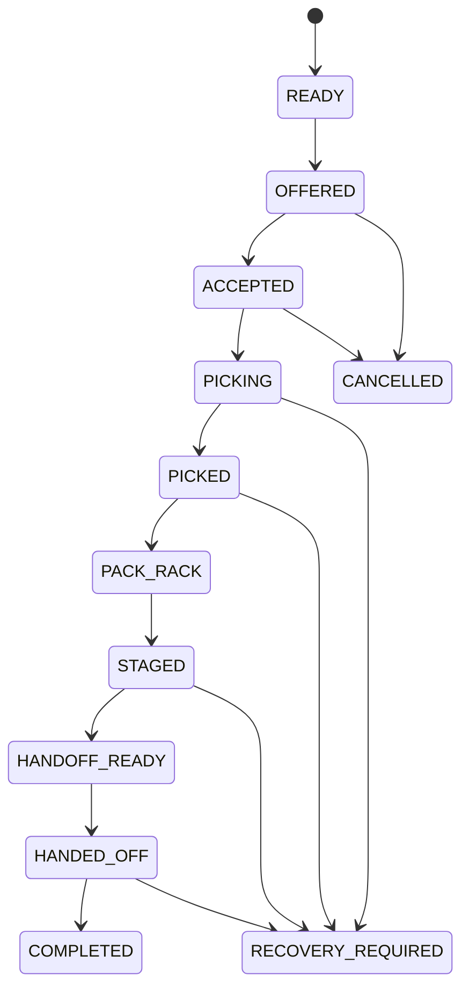
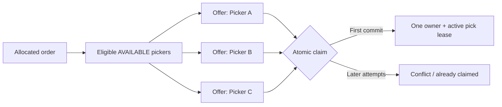
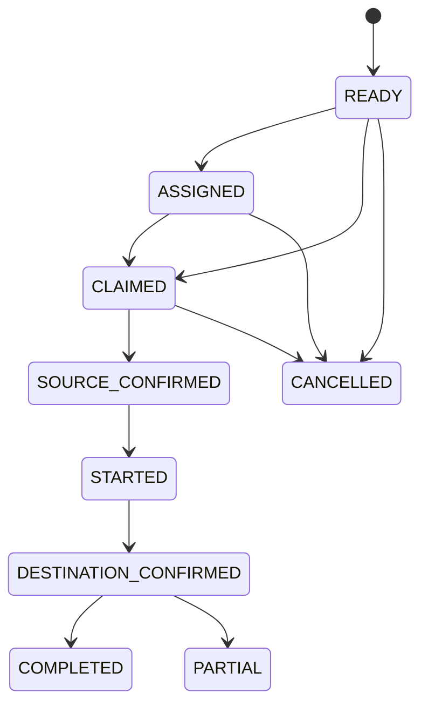
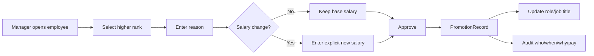

# FulfillOS workflows — v0.4

## 1. Inbound / returns



Damage moves to `DMG` instead of normal sellable storage.

Receiving can capture:

- good qty;
- damaged qty;
- missing qty;
- lot;
- expiry.

Chilled/frozen receiving exposes a target-stow timer.

## 2. Outbound picking



## 3. Broadcast dispatch



Eligibility evaluates:

- employee active state;
- picker-capable role;
- runtime state;
- existing active pick lease;
- HAZ/HRV qualification;
- optional allowed-domain profile.

## 4. One picker / one active order

A picker cannot receive or claim another active pick order while an active lease exists.

This is a backend/database invariant, not only a UI rule.

## 5. Manual dispatch

Supervisor/Team Leader flow:

```text
select order
→ fetch dispatchable workers
→ inspect state / active task / qualification / device context
→ assign
→ server re-validates eligibility
→ create ownership lease
```

Manual assignment cannot bypass break/receiving/stow/replenishment restrictions.

## 6. Pick scan protocol

```text
1. PDA creates event UUID + client sequence.
2. PDA persists the event locally.
3. PDA transmits.
4. Server validates ownership/state/bin/product/qty/version.
5. Server checks hard fulfillment stops.
6. Server commits inventory movement + task progress.
7. Server writes acknowledged scan evidence.
8. Server increments version.
9. Server returns authoritative snapshot.
10. PDA marks local event ACKED.
```

Retrying the same event ID does not pick twice.

## 7. Pick exceptions

### SKIP

```text
item unavailable right now
→ do not mutate inventory
→ defer line later in route
```

### SHORT

```text
picker confirms expected unit is absent
→ reconcile reserved/expected quantity
→ record shortage evidence
→ possibly open inventory alert
→ possibly create replenishment candidate
```

### DAMAGED

```text
item exists but is damaged
→ record exception
→ move affected stock to DMG where applicable
→ keep evidence
```

## 8. Bag / SPOO completion

```text
PICKED
→ scan Bag 1 SPOO
→ optional Bag 2..N SPOO
→ finish picking
→ completion summary
```

Completion summary includes:

- items;
- requested qty;
- picked qty;
- shorted qty;
- bag count;
- SPOO last four.

The server retains the full SPOO for search/audit.

## 9. Fulfillment availability hold

```text
Manager pauses scope
→ SITE / DOMAIN / ZONE / AISLE / BIN / SKU
→ physical stock stays unchanged
→ fulfillable stock recalculates
→ new allocation/orderability respects hold
```

Emergency mode:

```text
hard_stop = true
→ affected active pick scans are also rejected
```

A scheduled hold may expire automatically.

## 10. Replenishment v0.4



Worker flow:

```text
claim task
→ scan source bin
→ scan product
→ scan destination bin
→ enter/confirm actual quantity
→ server performs idempotent inventory movement
→ completed or partial
```

If partial, the backend can create a remainder task.

While executing replenishment, worker runtime state is `REPLENISHING`, so a new pick order is not dispatched to that worker.

## 11. Proactive replenishment generation

```text
scan pick faces
→ available qty <= configured threshold
→ no existing active replenishment
→ find compatible alternate/reserve stock
→ create READY replenishment task
→ priority based on stockout risk
```

The generator creates work; it does not move inventory by itself.

## 12. Route optimization

Baseline route:

```text
ambient / produce / HAZ / HRV
→ chilled
→ frozen
```

Within a domain, the optimizer can use:

- topology nodes;
- measured edge distance;
- one-way edges;
- congestion factor;
- aisle/slot fallback heuristic.

The intent is to avoid patterns such as warm → chiller → warm → freezer.

## 13. Cycle-count escalation

```text
repeated shortage / inventory alert
→ manager reviews alert
→ create Cycle Count session
→ worker counts physical stock
→ reconcile through explicit inventory adjustment
```

## 14. Shift template and rota

```text
Manager creates timezone-aware shift template
→ assign template to employee + date
→ roster contains scheduled start/end
→ employee clock-in uses nearby assignment
→ late-after-grace is calculated
→ clock-out calculates worked / early-leave / overtime
```

Overnight templates are supported by allowing the end clock time to fall on the following day.

## 15. Break

```text
employee has no active pick order
→ start break
→ runtime state = BREAK
→ dispatch blocked
→ end break
→ duration calculated
→ runtime state = AVAILABLE
```

An active pick lease prevents starting a normal break.

## 16. Leave request

```text
employee submits leave window
→ PENDING
→ manager review
→ APPROVED / REJECTED
→ approved scheduled assignments in window become LEAVE
```

## 17. Overtime request

```text
employee requests overtime minutes
→ PENDING
→ manager approves 0..requested minutes
→ APPROVED or REJECTED
→ payroll/time review can reference approved amount
```

## 18. Warehouse promotion

Operational ladder:

```text
PICKER
→ SENIOR_PICKER
→ QUALITY
→ QUALITY_LEADER
→ TEAM_LEADER
→ SUPERVISOR
```

Promotion flow:



Rules:

- target must be above current warehouse rank;
- ADMIN is not a promotion target;
- promotion cannot silently reduce salary;
- generic profile PATCH cannot bypass this workflow.

## 19. Permission override

```text
default role permissions
→ optional role-level grant/deny
→ optional user-level grant/deny
→ effective permissions
```

User override has the most specific effect.

## 20. Payroll review

```text
base salary
+ approved overtime
+ approved pay adjustments
- configured attendance deductions (only if enabled)
= payroll preview
```

Operational performance such as late SLAM remains separate evidence and does not automatically change pay.

## 21. Password recovery

Current fallback:

```text
Forgot password request
→ pending manager queue
→ manager issues temporary password
→ old sessions revoked
→ user changes password
```

Planned self-service:

```text
verified email/SMS
→ short-lived single-use token
→ new password
→ revoke sessions
→ security notification
```

## 22. Schema migration

Existing production database:

```text
startup
→ advisory lock
→ detect pre-Alembic schema
→ stamp verified baseline
→ upgrade to head
→ unlock
```

Fresh database:

```text
startup
→ advisory lock
→ create current metadata
→ stamp head
→ unlock
```
