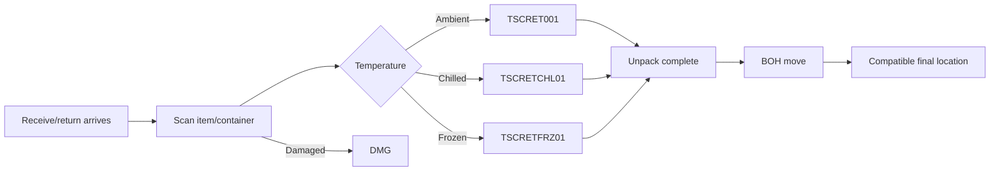
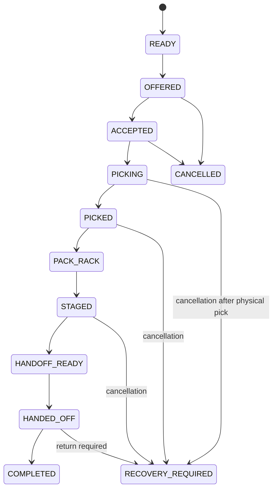

# Workflows

## Inbound / returns



A BOH move is a first-class inventory movement with a unique event id. It is not a UI-only reassignment.

## Outbound picking



## Scan flow

```text
1. PDA creates UUID event id + monotonically increasing client sequence.
2. PDA writes the event to durable local storage.
3. PDA transmits the event.
4. Server validates bin/product/qty/task ownership/version.
5. Server commits inventory + task state atomically.
6. Server returns authoritative snapshot and event ACK.
7. PDA marks the local event ACKED and renders server-confirmed progress.
```

If step 3 or 6 fails, the exact same event id is retried. The server does not double-pick it.

## Reboot recovery

```text
Android process/device restarts
  -> session refresh from secure device-bound refresh credential
  -> fetch active task
  -> load local pending event journal
  -> sync events in client-sequence order
  -> receive authoritative snapshot
  -> reconcile UI
  -> resume
```

The user may still be asked to re-authenticate according to security policy, but task state cannot depend on the previous process staying alive.
