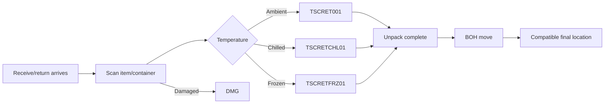
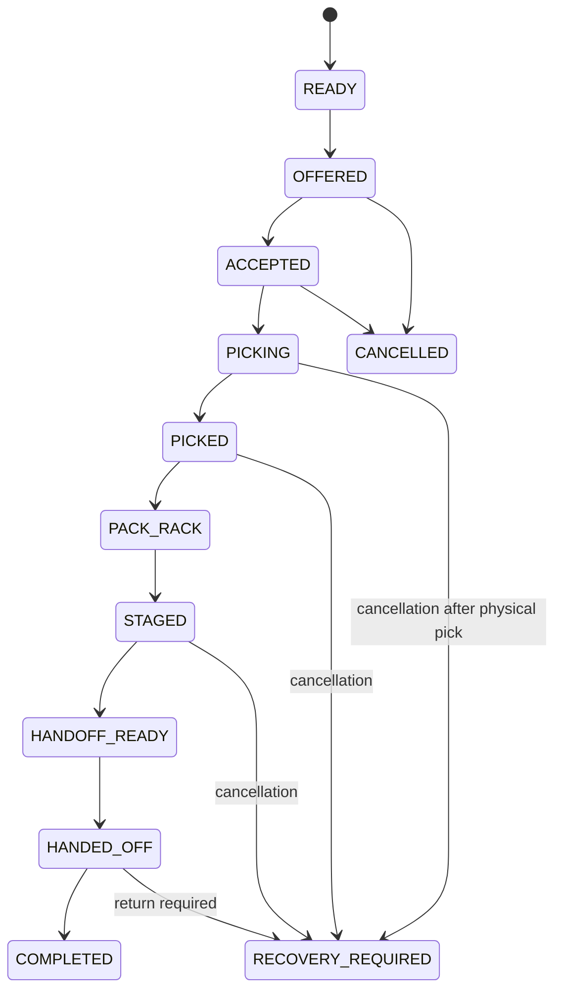

# Workflows

## Inbound / returns



A BOH move is a first-class inventory movement with a unique event id. It is not a UI-only reassignment.

## Outbound picking



## Scan flow

```text
1. PDA creates UUID event id + monotonically increasing client sequence.
2. PDA writes the event to durable local storage.
3. PDA transmits the event.
4. Server validates bin/product/qty/task ownership/version.
5. Server commits inventory + task state atomically.
6. Server returns authoritative snapshot and event ACK.
7. PDA marks the local event ACKED and renders server-confirmed progress.
```

If step 3 or 6 fails, the exact same event id is retried. The server does not double-pick it.

## Reboot recovery

```text
Android process/device restarts
  -> session refresh from secure device-bound refresh credential
  -> fetch active task
  -> load local pending event journal
  -> sync events in client-sequence order
  -> receive authoritative snapshot
  -> reconcile UI
  -> resume
```

The user may still be asked to re-authenticate according to security policy, but task state cannot depend on the previous process staying alive.

## v0.3 broadcast dispatch

Allocated orders are offered to every eligible AVAILABLE picker. The first successful server-side atomic claim owns the order; later accepts fail without changing ownership. A picker is ineligible while another active pick lease exists or while the worker is on break, receiving, stowing, unpacking, cycle counting, doing expiry/bin work, training, or ending shift.

## Fulfillment availability

A hold can target SITE, DOMAIN, ZONE, AISLE, BIN or SKU. Physical stock means what is actually on hand. Fulfillable stock means available stock in enabled scopes. Blocked stock is inventory hidden by effective holds. Normal holds affect new allocation; hard-stop additionally rejects affected pick scans.

## Pick exceptions

- SKIP: defer the line to the end of the route; inventory does not change.
- SHORT: picker verified expected stock is absent; the reserved phantom unit is reconciled.
- DAMAGED: item is present but damaged; the unit moves to DMG.

Repeated SHORT/DAMAGED evidence can open an inventory alert and create a replenishment candidate from alternate compatible stock. The picker does not leave the active order to replenish.

## Bag / SPOO completion

After PICKED, the picker scans one or more bag SPOOs, then finishes the pick session. The server stores the full SPOO for audit/search and returns the last four to the picker completion summary together with all item quantities.

## Receive and stow

Shipment → Dock Check-In → Open Receiving → domain validation → good/damaged/missing reconciliation → generated stow tasks → compatible destination recommendation → stow → shipment complete. Chilled/frozen shipments expose a target-stow timer. HAZ/HRV require worker qualification.

## Shift and payroll time

Clock-in/out produces factual late-after-grace, worked, early-leave and overtime minutes. Payroll may auto-apply configured attendance deductions only when an explicit worker policy enables them. Picking performance never directly changes role or pay.
